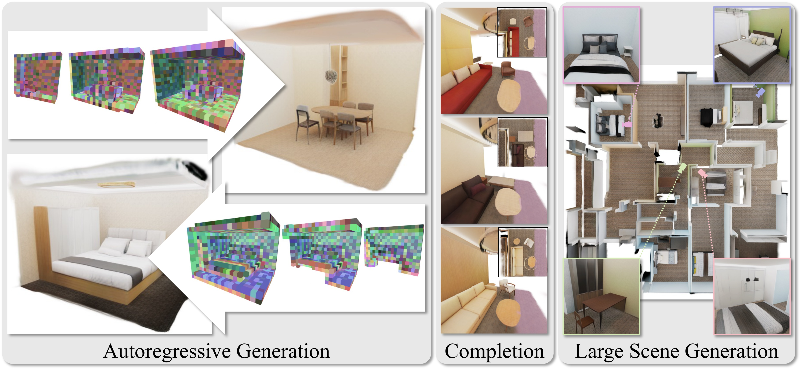

<div align="center">

# GaussianGPT: Towards Autoregressive 3D Gaussian Scene Generation

**Nicolas von Lützow · Barbara Rössle · Katharina Schmid · Matthias Nießner**

### ECCV 2026

[Project Page](https://nicolasvonluetzow.github.io/GaussianGPT/) · [arXiv](https://arxiv.org/abs/2603.26661) · [Paper](https://arxiv.org/pdf/2603.26661) · [Video](https://youtu.be/zVnMHkFzHDg)



</div>

## Abstract

Most recent advances in 3D generative modeling rely on diffusion or
flow-matching formulations. We instead explore a fully autoregressive
alternative and introduce GaussianGPT, a transformer-based model that directly
generates 3D Gaussians via next-token prediction, thus facilitating full 3D
scene generation. We first compress Gaussian primitives into a discrete latent
grid using a sparse 3D convolutional autoencoder with vector quantization. The
resulting tokens are serialized and modeled using a causal transformer with 3D
rotary positional embedding, enabling sequential generation of spatial structure
and appearance. Unlike diffusion-based methods that refine scenes holistically,
our formulation constructs scenes step-by-step, naturally supporting completion,
outpainting, controllable sampling via temperature, and flexible generation
horizons. This formulation leverages the compositional inductive biases and
scalability of autoregressive modeling while operating on explicit
representations compatible with modern neural rendering pipelines, positioning
autoregressive transformers as a complementary paradigm for controllable and
context-aware 3D generation.

## News

- **2026-07-01** - Pre-trained scene-level VQ-VAE and GPT checkpoints released.
- **2026-06-19** - Training and inference code released.
- **2026-06-18** - GaussianGPT accepted to ECCV 2026!

## Overview

This repository contains the full training and inference code for GaussianGPT.
The pipeline is two trained models connected by a tokenization step:

1. **VQ-VAE** (`train_ae.py`) — a sparse 3D CNN with vector quantization that
   compresses per-voxel Gaussians into discrete tokens, supervised by a `gsplat`
   re-rendering loss.
2. **Tokenization** (`tokenize_dataset.py`) — runs the trained encoder over the
   dataset and writes per-scene token streams to disk.
3. **GPT** (`train_gpt.py`) — an autoregressive transformer with 3D rotary
   embeddings that models the token streams via next-token prediction.
4. **Inference** — sample from the GPT and decode through the frozen VQ-VAE to
   generate, complete, or tile Gaussian scenes, then render them.

```
Gaussians --VQ-VAE--> tokens --GPT--> sampled tokens --decode--> Gaussians --render-->
```

Everything is configured with [Hydra](https://hydra.cc/); override any field on
the CLI as `key=value`.

## Citation

If you find GaussianGPT useful, please consider citing:

```bibtex
@misc{vonluetzow2026gaussiangpt,
  title         = {GaussianGPT: Towards Autoregressive 3D Gaussian Scene Generation},
  author        = {von L{\"u}tzow, Nicolas and R{\"o}{\ss}le, Barbara and Schmid, Katharina and Nie{\ss}ner, Matthias},
  year          = {2026},
  eprint        = {2603.26661},
  archivePrefix = {arXiv},
  primaryClass  = {cs.CV},
  url           = {https://arxiv.org/abs/2603.26661},
}
```

## Contents

- [Installation](#installation)
- [Data](#data)
- [Training](#training)
- [Checkpoints](#checkpoints)
- [Inference](#inference)
- [Rendering](#rendering)
- [Acknowledgements](#acknowledgements)
- [License](#license)

## Installation

The environment is built around CUDA 12.9 and PyTorch 2.8. Several
dependencies are compiled from source, so make sure a GPU is visible during
installation for correct CUDA support.

### 1. Compilation targets

Set the target architectures before any from-source build. Refer to the
[NVIDIA GPU feature list](https://docs.nvidia.com/cuda/cuda-compiler-driver-nvcc/index.html#gpu-feature-list)
for your hardware.

```bash
export TORCH_CUDA_ARCH_LIST="8.6;8.0"   # e.g. Ampere (3090, A6000, A100)
```

### 2. Environment and core dependencies

```bash
conda create -n gaussiangpt python=3.10 nvidia::cuda-toolkit=12.9 conda-forge::glm ninja
conda activate gaussiangpt

# Point CUDA_HOME at the conda toolkit (persist for future sessions and apply now).
ln -s "$CONDA_PREFIX/lib" "$CONDA_PREFIX/lib64"
conda env config vars set CUDA_HOME="$CONDA_PREFIX"
export CUDA_HOME="$CONDA_PREFIX"

pip install torch==2.8.0 torchvision torchaudio --index-url https://download.pytorch.org/whl/cu129
pip install --no-build-isolation -r requirements.txt   # compiles several extensions; slow
```

`requirements.txt` installs two CUDA extensions from pinned git commits that are
**compiled from source** during this step (hence the GPU-visible requirement and
the long build time): [`gsplat`](https://github.com/nerfstudio-project/gsplat)
(the re-rendering loss / renderer) and
[`pytorch3d`](https://github.com/facebookresearch/pytorch3d) (rotation/quaternion
ops in `utils/transforms.py`). If the install fails, it is almost always one of
these two — build them individually to see the full nvcc error, and make sure
`TORCH_CUDA_ARCH_LIST` and `CUDA_HOME` are set as above.

### 3. Flash Attention

```bash
git clone https://github.com/Dao-AILab/flash-attention.git
cd flash-attention
git checkout v2.8.2
MAX_JOBS=4 python setup.py install
```

<details>
<summary>Troubleshooting: <code>MAX_JOBS=1</code></summary>

Each nvcc job needs several GB of RAM. Start `MAX_JOBS` low and raise it only if
you have the RAM to spare; lower it (down to 1) if the build OOMs / gets "Killed".

</details>

<details>
<summary>Optional: <code>FLASH_ATTN_CUDA_ARCHS=80</code></summary>

flash-attn compiles its own arch set (sm_80;90;100;120) and ignores
`TORCH_CUDA_ARCH_LIST`. Its Ampere kernels are sm_80, which also run on sm_86
(3090/A6000) via same-major forward-compat, so restricting to sm_80 covers all
the target GPUs above and cuts both compile time and per-job RAM substantially.

</details>

### 4. MinkowskiEngine

The upstream MinkowskiEngine does not build against CUDA 12 without source
patches. The [alpsaur fork](https://github.com/alpsaur/MinkowskiEngine/tree/cuda12-compat)
bundles the CUDA 12 fixes, so no manual patching is needed:

```bash
git clone https://github.com/alpsaur/MinkowskiEngine.git --branch cuda12-compat
cd MinkowskiEngine
conda install -c conda-forge "blas=*=openblas" openblas openblas-devel
python setup.py install --blas_include_dirs="${CONDA_PREFIX}/include" --blas=openblas
```

<details>
<summary>Compiler note: build with GCC &lt;= 13</summary>

MinkowskiEngine does not compile with **GCC >= 14** against PyTorch 2.8's bundled
pybind11 — you'll hit `ambiguous template instantiation` errors on the `enum_`
registrations. Use **GCC <= 13** (GCC 11 is known good). The `openblas-devel`
install above can pull a newer GCC from conda-forge into the env, so after running
it check `${CXX} --version`; if it reports 14+, pin an older toolchain and
reactivate so conda repoints `CC`/`CXX` before building:

```bash
conda install -c conda-forge gcc_linux-64=11 gxx_linux-64=11
conda deactivate && conda activate gaussiangpt   # reactivate to refresh CC/CXX
```

If conda balks at re-solving `cuda-toolkit`, pin it explicitly and freeze the
rest: `conda install -c nvidia -c conda-forge cuda-toolkit=12.9.2
gcc_linux-64=11 gxx_linux-64=11 --freeze-installed`.

</details>

<details>
<summary>Alternative: official repo with manual patches</summary>

Clone upstream and apply the CUDA 12 source patches yourself, following
[issue #543](https://github.com/NVIDIA/MinkowskiEngine/issues/543#issuecomment-1773458776):

```bash
git clone https://github.com/NVIDIA/MinkowskiEngine.git
cd MinkowskiEngine
# Apply the CUDA 12 source patches from the issue above before building.
conda install -c conda-forge "blas=*=openblas" openblas openblas-devel
python setup.py install --blas_include_dirs="${CONDA_PREFIX}/include" --blas=openblas
```

</details>

<details>
<summary>Optional: per-voxel dedup (<code>torch_scatter</code>)</summary>

Not required for the default pipeline. Only needed if you enable
`model.make_unique=true` (collapse each voxel to its highest-opacity Gaussian),
which is **off** in the shipped configs. The import is lazy, so the dependency is
only touched when that option is turned on. In our tests it gave a negligible
quality gain for the added compute.

```bash
pip install --no-build-isolation torch-scatter -f "https://data.pyg.org/whl/torch-2.8.0+cu129.html"
```

</details>

## Data

We are grateful to the authors of the following datasets, whose data made this work
possible. Please refer to the respective sources for licensing and download instructions.

| Dataset | Source data | Gaussians |
| --- | --- | --- |
| PhotoShape | [original data](https://github.com/keunhong/photoshape) | optimized using simplified [Scaffold-GS](https://city-super.github.io/scaffold-gs/) |
| ASE | [original data](https://www.projectaria.com/datasets/ase/) | from [SceneSplat-49k](https://huggingface.co/datasets/GaussianWorld/aria_synthetic_envs_mcmc_3dgs_new) |
| 3D-FRONT | [original data](https://tianchi.aliyun.com/specials/promotion/alibaba-3d-scene-dataset) (no longer available) | optimized using simplified [Scaffold-GS](https://city-super.github.io/scaffold-gs/) |

**3D-FRONT note:** the original source data is no longer available, but more recent
re-releases (e.g. [this one](https://huggingface.co/datasets/huanngzh/3D-Front)) should
work similarly.

**Scaffold-GS note:** for the PhotoShape and 3D-FRONT Gaussians we use a simplified
Scaffold-GS: no MLP, one Gaussian per voxel, and no hierarchy. Gaussians are initialized
from depth maps and anchors are not adjusted during optimization.

## Training

Training is a two-stage pipeline (VQ-VAE, then GPT) with a tokenization step in
between. Checkpoints and logs land under `experiment.log_dir` (`logs/` by
default), organized by `experiment.name`.

### Preparing train/val splits

The dataset configs reference scene-name lists under `data_splits/`. Two
standalone helpers under `scripts/` build them in two steps — scan once to
produce a per-scene stats CSV, then filter that CSV into train/val splits
(re-run the cheap second step with different thresholds without re-scanning):

```bash
python scripts/dataset_quick_stats.py \
    --data-root <gaussians_root> --transforms-root <transforms_root> \
    --output logs/stats.csv

python scripts/dataset_split_from_quick_stats.py \
    --input logs/stats.csv \
    --train-split data_splits/train.txt --val-split data_splits/val.txt \
    --min-images 100 --max-points 5000000 \
    --min-extent-x 3.2 --max-extent-x 25 \
    --min-extent-y 3.2 --max-extent-y 25 --max-extent-z 4
```

All filters default to off; pass `--help` on either script for the full set.

### 1. VQ-VAE

Trains the sparse-CNN autoencoder with vector quantization that compresses
per-voxel Gaussians into discrete tokens. Reconstruction is supervised by a
re-rendering loss (`gsplat`).

```bash
python train_ae.py \
    data=vfront_houses \
    experiment.name=my_vqvae
```

- Top-level config: `conf/vqvae.yaml` (`data=vfront_houses`, `model=vqvae_cnn`,
  `training=vqvae`). Swap the dataset with `data=photoshape`, `data=ase`,
  `data=spp_v2`, etc.
- Loss weights live in `conf/training/vqvae.yaml`; the defaults target
  VFront/ASE, and the file notes the PhotoShape overrides.
- `max_epochs` is a deliberate overestimate — stop the run by picking a
  checkpoint rather than waiting for it to finish.
- Resume with `experiment.checkpoint_path=<ckpt> experiment.continue_mode=resume`
  (or `weights_only` to load only the weights and reset the optimizer/scheduler).

### 2. Tokenization

Runs the trained VQ-VAE encoder over the dataset and writes per-scene token
streams to disk. The output directory becomes `data.data_path` for the GPT
stage, and the VQ-VAE checkpoint becomes `data.vqvae_path`.

```bash
python tokenize_dataset.py \
    data=vfront_houses \
    experiment.checkpoint_path=<vqvae.ckpt> \
    training.tokenization.output_dir=<tokens_dir>
```

- Shares the `conf/vqvae.yaml` config; only `experiment.checkpoint_path` and
  `training.tokenization.output_dir` are required (both are asserted at startup).
- `training.tokenization.sort_by` controls latent ordering;
  `training.tokenization.generate_augmented_samples=true` writes 8 variants per
  scene (4 z-rotations x mirrored/not).

### 3. GPT

Trains the autoregressive transformer prior over the VQ tokens. The frozen
VQ-VAE is loaded from `data.vqvae_path` and used only for decoding during the
inline evaluation.

```bash
python train_gpt.py \
    data=tokenized_vfront \
    data.data_path=<tokens_dir> \
    data.vqvae_path=<vqvae.ckpt> \
    experiment.name=my_gpt
```

- Top-level config: `conf/gpt.yaml` (`data=tokenized_vfront`, `model=gpt`,
  `training=gpt`). Use `data=tokenized_vfront_ase` for the combined VFront+ASE
  model. `data_path` and `vqvae_path` are required (`???`) in the tokenized data
  configs and must be supplied.
- Transformer size is set inline via the `gpt_size` block in
  `conf/model/gpt.yaml` (`n_embd`, `n_layer`, `n_head`, `n_kv_head`). The default
  (`n_embd=1024`, `n_layer=24`) matches GPT-2-medium.
- Multi-GPU is auto-detected: the run uses `ddp` when more than one GPU is
  visible.
- Evaluation runs **inline** via `EvaluateCallback`, cadenced by
  `training.output.render_frequency`.
  `training.output.eval_data_config` selects which raw `conf/data/*.yaml` is
  composed for the rendering.
- `experiment.continue_run=true` auto-finds the latest checkpoint from a prior
  run with the same `log_dir`/`name`.

## Checkpoints

Pre-trained VQ-VAE and GPT checkpoints are hosted at
`kaldir.vc.cit.tum.de/gaussiangpt` (sizes and SHA256 checksums in the served
[README](https://kaldir.vc.cit.tum.de/gaussiangpt/README.md)). Each GPT must be
paired with the VQ-VAE listed alongside it.

```bash
# Trained on 3D-FRONT
wget https://kaldir.vc.cit.tum.de/gaussiangpt/vqvae_vfront.ckpt
wget https://kaldir.vc.cit.tum.de/gaussiangpt/gpt_vfront.ckpt

# Pre-trained on 3D-FRONT + ASE, fine-tuned on 3D-FRONT
wget https://kaldir.vc.cit.tum.de/gaussiangpt/vqvae_both.ckpt
wget https://kaldir.vc.cit.tum.de/gaussiangpt/gpt_both.ckpt
```

Pass them to any inference entry point as `checkpoint=<gpt.ckpt>
vqvae_checkpoint=<vqvae.ckpt>` (see [Inference](#inference)).

Object-level checkpoints are not yet available and will be added soon.

## Inference

All inference entry points take the trained GPT via `checkpoint=<gpt.ckpt>` and
need a VQ-VAE checkpoint to decode sampled tokens. The VQ-VAE is resolved as
`vqvae_checkpoint=<vqvae.ckpt>` (explicit override) → `model.vqvae.checkpoint_path`
→ `data.vqvae_path` from a composed `data=<cfg>`. The token streams
(`data.data_path`) are only read when conditioning on real scenes (completion);
unconditional sampling does not touch them.

### Single-chunk generation / evaluation

Samples one chunk per scene, decodes through the VQ-VAE, and renders camera
trajectories. This module also provides the inline-eval helpers imported by
`train_gpt.py`.

```bash
# Unconditional generation: only the GPT and a VQ-VAE checkpoint are needed.
python generate_chunks.py \
    checkpoint=<gpt.ckpt> \
    vqvae_checkpoint=<vqvae.ckpt> \
    num_samples=4 temperature=1.0
```

Key options (see `conf/generate_chunks.yaml`, the config `generate_chunks.py` loads):
`num_samples`, `batch_size`, `temperature`/`top_k`/`top_p`, `seed`,
`store_samples`, `render_gifs` (set `render_gifs=false` to skip GIF rendering,
e.g. to only dump samples via `store_samples=true`). Outputs go to `output_dir`
(`outputs/eval` by default).

<details>
<summary>Prompt-conditioned completion (sequence-prefix sanity check)</summary>

`generate_chunks.py` can also condition on a real scene by enabling
`completion`: it keeps the first `prompt_fraction` of the token sequence and
continues it, producing one completion per scene. This is a quick sanity check
on the prior, used primarily during training. For completion cut by **spatial
extent**, use `complete_chunks.py` below.

```bash
python generate_chunks.py \
    checkpoint=<gpt.ckpt> \
    data=tokenized_vfront \
    data.data_path=<tokens_dir> data.vqvae_path=<vqvae.ckpt> \
    completion.enabled=true completion.prompt_fraction=0.5
```

The prompts are read from the tokenized `data=<cfg>` (`completion.split`
selects train/val); `prompt_fraction` is a continuous float (default 0.5).

</details>

### Chunk completion / outpainting

Conditions on part of a scene and samples the rest — the autoregressive analogue
of inpainting/outpainting. The prompt is cut by **spatial extent** (e.g. keep
half the room along x) rather than by sequence length, and several completions
are sampled per scene.

```bash
python complete_chunks.py \
    checkpoint=<gpt.ckpt> \
    data=tokenized_vfront \
    data.data_path=<tokens_dir> data.vqvae_path=<vqvae.ckpt> \
    prompt_mode=spatial_half_x
```

Key options (see `conf/complete_chunks.yaml`): `split`, `prompt_mode`,
`num_completions`, `num_samples`, the
sampling params, and `render_gifs`/`store_tokens`. Supports sharding via
`shard_id`/`num_shards`. Outputs go to `outputs/complete_chunks`.

### Large multi-chunk scenes

`generate_scene.py` autoregressively tiles many chunks into a large scene, then
`decode_scene.py` turns the saved token sidecars into renderable Gaussian
payloads. `generate_scene.py` shards over the tile grid via the `GAUSS_SHARD_ID`
/ `GAUSS_NUM_SHARDS` env vars, so it runs cleanly as a SLURM array — each task
only reads/writes its own `rank_XXXX` shard.

```bash
# Sample (single shard shown; for a SLURM array set the two env vars per task).
GAUSS_SHARD_ID=0 GAUSS_NUM_SHARDS=1 python generate_scene.py \
    checkpoint=<gpt.ckpt> \
    vqvae_checkpoint=<vqvae.ckpt> \
    num_scenes=4 output_dir=<scene_out>

# Decode the token sidecars into Gaussian scenes.
python decode_scene.py \
    --output-dir <scene_out> \
    --vqvae-checkpoint <vqvae.ckpt>
```

`generate_scene.py` can decode and render top-down inline (`decode_outputs`,
`render_topdown`, both on by default); see `conf/generate_scene.yaml` for the
tiling (`scene_cols_x/y`), the bootstrap/outpainting sampling params, and the
empty-column handling. `decode_scene.py` infers the GPT checkpoint from the run
manifest, so only `--output-dir` and `--vqvae-checkpoint` are required.

## Rendering

Standalone renderers operate on decoded scene `.pt` payloads (keys `coords`,
`sh0`, `opacities`, `scales`, `quats`):

```bash
# Single top-down PNG.
python render_topdown.py --input <scene.pt> --quantile 75 --resolution 1024

# Rotating-orbit GIFs for one scene or a directory of scenes.
python render_orbit_batch.py --input <scene_or_dir> --output-dir <render_out>
```

`render_topdown.py` drops points above `--quantile` (to see through ceilings).
`render_orbit_batch.py` accepts a single `.pt` or
a directory (`--max-files` caps how many it processes) and writes per-frame
images plus a GIF under `--output-dir`.

To inspect a payload in an external viewer, `scripts/convert_pt_to_ply.py`
converts a Gaussian `.pt`/`.pth` payload to an INRIA-style `.ply`.

## Acknowledgements

This work would not have been possible without the following open-source projects, and we thank their authors and contributors.

- [gsplat](https://github.com/nerfstudio-project/gsplat)
- [MinkowskiEngine](https://github.com/NVIDIA/MinkowskiEngine)
- [Flash-Attention](https://github.com/Dao-AILab/flash-attention)
- [vector-quantize-pytorch](https://github.com/lucidrains/vector-quantize-pytorch)
- [nanochat](https://github.com/karpathy/nanochat)

## License

This project is released under the MIT License. See [LICENSE](LICENSE) for details.
